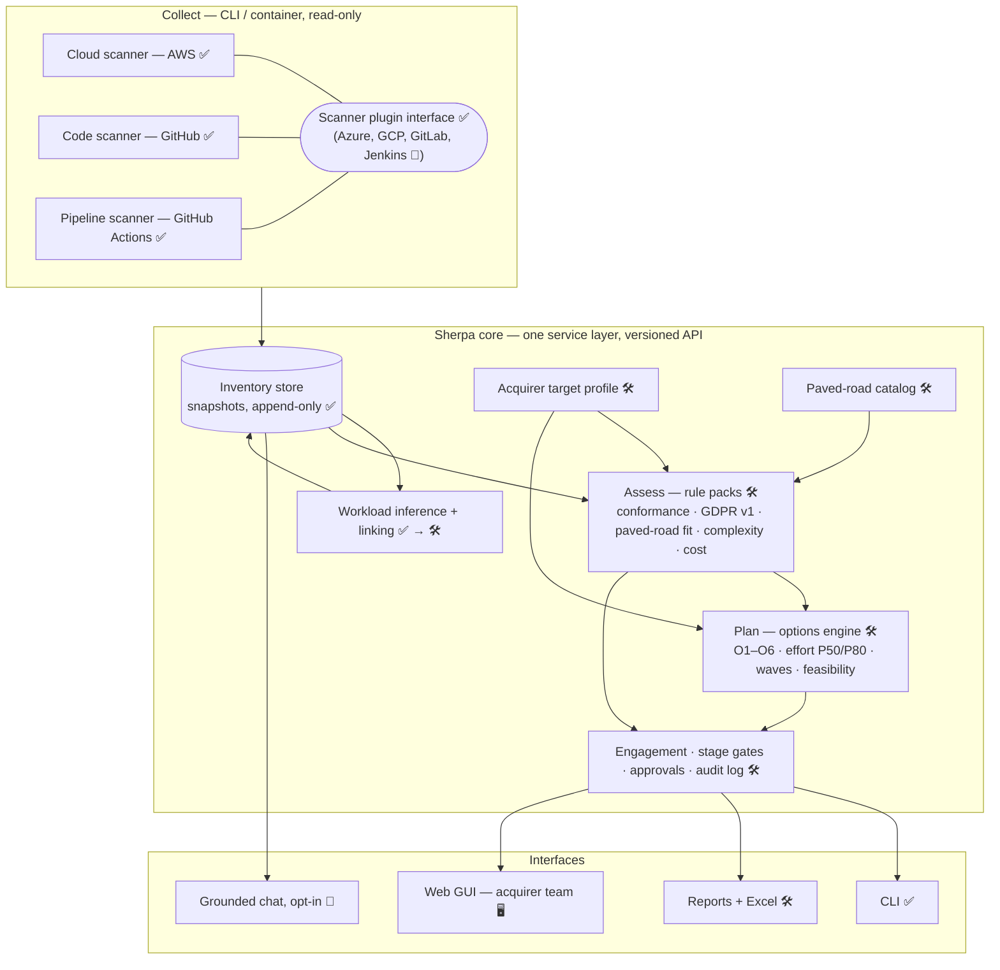
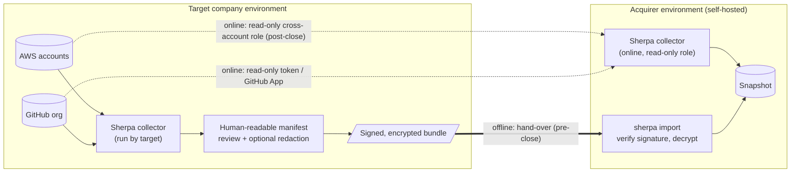
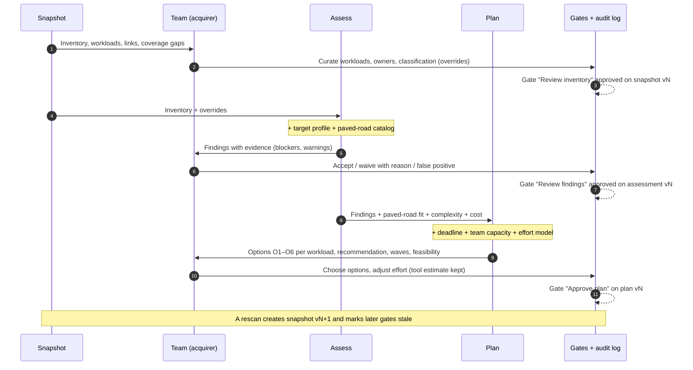
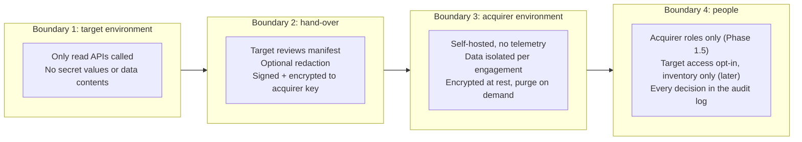

# Architecture and Data Flow

> **Status legend:** ✅ exists today (being hardened) · 🛠️ MVP (Phase 1) · 🖥️ Phase 1.5 · 🔭 later.
> Only the discovery skeleton exists today. Everything else here is the target design.

## Component view

## Data flow: online and offline

Both paths end in the **same snapshot format**, so everything downstream is identical.

## Data flow: from snapshot to approved plan

## Trust boundaries

## Key rules for contributors

- Collectors call **read-only** APIs and never serialise credentials.
- **No cloud SDK** in the core — cloud-specific code lives in scanner plugins.
- **Deterministic** output: content-derived IDs, stably sorted lists.
- **Errors become coverage gaps** — never swallowed.
- **All business logic is in the core service layer.** The CLI and GUI are thin clients.

Full design principles: [`CLAUDE.md`](https://github.com/pankajads/sherpa/blob/main/CLAUDE.md) · Detailed plan: [`docs/planning/02-phased-plan.md`](https://github.com/pankajads/sherpa/blob/main/docs/planning/02-phased-plan.md)
