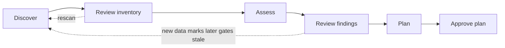

# How It Works

## The workflow

Sherpa runs every acquisition as an **engagement** that moves through fixed stage gates. Each gate is approved by a named person and is tied to the exact version of the data they reviewed. If anything is rescanned, later approvals are marked **stale** — never silently carried over.

| Stage | What happens | Who |
|---|---|---|
| **Discover** | Scan AWS + GitHub (online) or import the target's bundle (offline). | Platform engineer / target team |
| **Review inventory** | Curate workload groupings, set owners and data classification, triage anything unassigned. | Acquirer architects |
| **Assess** | Run rule packs: landing-zone conformance, GDPR, paved-road fit, complexity, cost. | Automatic |
| **Review findings** | Accept, waive (with reason and expiry) or mark false positives. | Architects, security/compliance |
| **Plan** | Compare options per workload, adjust effort, build waves, check feasibility against deadline and capacity. | Integration lead, architects |
| **Approve plan** | Sign off the plan version for the steering committee. | Approver |

## Collection modes

| | Online | Offline |
|---|---|---|
| **When** | After close, once a read-only cross-account role is in place | Before close, or when no connection is agreed |
| **Who runs it** | The acquirer | The target company |
| **What moves** | API calls from Sherpa into the target's accounts | A signed, encrypted bundle the target reviewed first |
| **Result** | Snapshot | **The same snapshot format** |

## Migration options

For every workload, Sherpa shows each option side by side:

| Option | What it means |
|---|---|
| **O1 Relocate** | Move the AWS account(s) as-is into your AWS Organization; fix guardrail violations only. Often the fastest path when both companies run on AWS. |
| **O2 Lift-and-shift** | Rebuild the same architecture in an account vended by your landing zone; copy the data. |
| **O3 Re-platform onto paved road** | Swap components for your standard equivalents (container platform, managed databases, CI templates, IaC modules) without a redesign. |
| **O4 Modernize** | Re-architect to best practice and full paved-road alignment. |
| **O5 Retire** | Decommission idle or redundant workloads. |
| **O6 Retain** | Leave in place for now (e.g. under a transition services agreement) with a revisit date. |

Each option card shows:
- **viability** (viable, viable with conflict, or not viable, with the reason);
- **effort range** (P50/P80 engineer-weeks) with a breakdown: infrastructure, data, app changes, CI/CD, compliance fixes, testing and cutover;
- **calendar duration** given your team capacity;
- **paved-road alignment** after migration, and the remaining gaps;
- **compliance flags** and **risk**;
- **key assumptions** and a **confidence** level.

Sherpa marks a recommended option based on your deadline and capacity. Your team chooses, and can adjust the effort; both the tool estimate and the team estimate are kept.

## What you provide

| Input | Purpose |
|---|---|
| **Target profile** | Allowed regions, guardrails/SCPs, reserved IP ranges, required tags, encryption/logging baselines, team capacity, deadlines. |
| **Paved-road catalog** | Your standard platforms, data stores, pipeline templates and modules, with rules for which source patterns they replace. |
| **Data classification** | Where personal or regulated data lives (tags, a file, or optional Amazon Macie findings). Sherpa can't infer this. |
| **Overrides** | Corrections to workload grouping, owners, chosen options and effort. They survive rescans. |

## What you get

- An **executive report**: estate summary, cost, top risks and blockers, the mix of options, waves, feasibility and assumptions.
- An **Excel workbook** for the programme office: workloads, options, paved-road gaps, resources, findings, waves and overrides.
- **Versioned JSON** for other tools.
- From Phase 1.5, a **web app** for your team to review, compare and approve.
